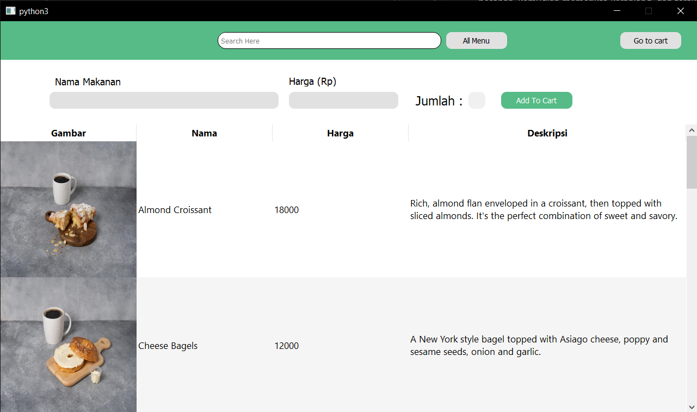
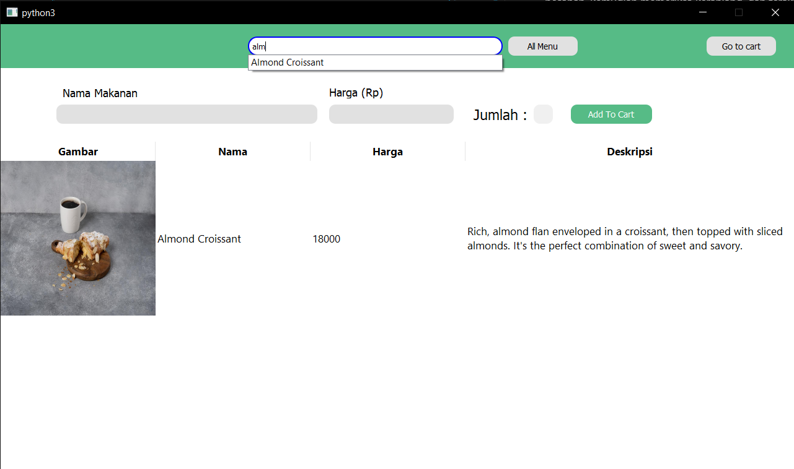
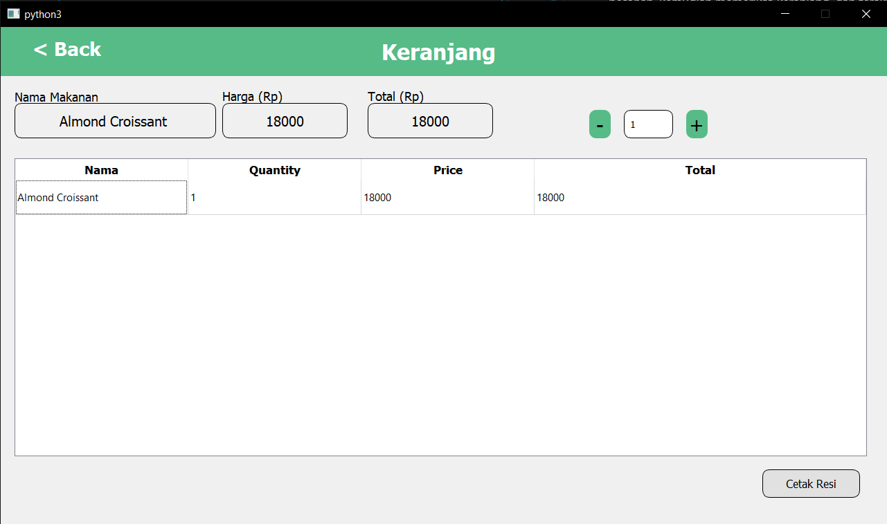
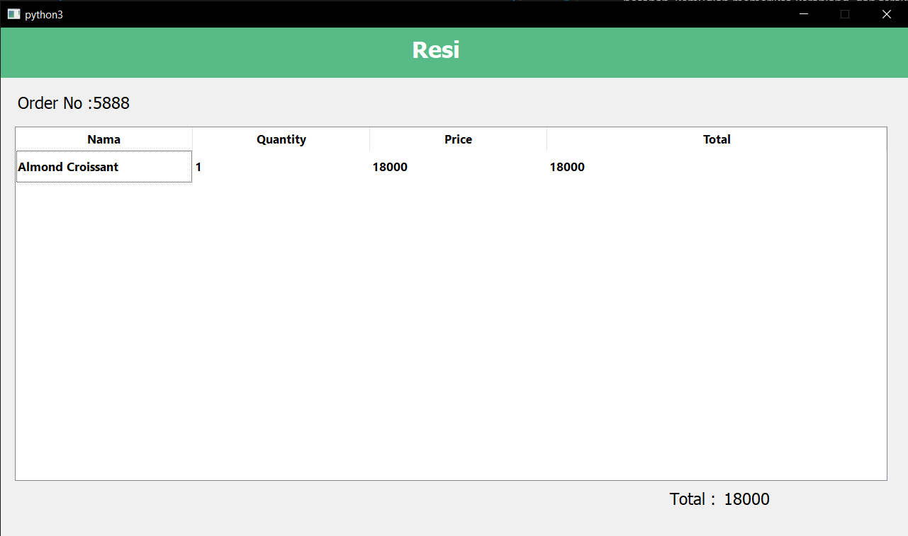

<h1 align="center">
  <br>
  RPL_Kelompok8
  <br>
  <br>
</h1>

Daftar Isi
- [Penjelasan Aplikasi](#penjelasan-aplikasi)
- [Cara Menjalankan Aplikasi](#cara-menjalankan-aplikasi)
- [Daftar Modul](#daftar-modul)
  - [Menu](#menu)
  - [Pemesanan](#pemesanan)
  - [Check Out](#check-out)
- [Daftar Tabel Basis Data](#daftar-tabel-basis-data)
- [Kelompok 8](#kelompok-8)

<br>

# Penjelasan Aplikasi

Natasya Wow Food Ordering System (NW-FOS) merupakan food ordering system yang ditujukan untuk pemakaian di meja-meja restoran melalui tablet-tablet. Pelanggan membuka dan memesan tanpa melakukan login, dengan nomor resi digenerasi secara otomatis. Pelanggan memilih menu dengan memasukkan jumlah pesanan, kemudian memeriksa keranjang, dan terakhir melakukan checkout sehingga resi ditampilkan.

<br>

# Cara Menjalankan Aplikasi
 Pastikan PyQT telah terinstall pada device yang akan digunakan. Navigasi ke directory utama pada terminal. Lakukan run dengan `code runner` pada main.py dengan `python main.py`. 
 <br>
 Atau dapat juga dilakukan run dengan menjalankan command berikut.
```
python -u ".\src\main.py"
```

<br>

# Daftar Modul

## Menu
Terdapat tiga komponen utama pada menu: search bar, tampilan menu, dan tombol pemesanan dan penambahan pesanan.
<br>
Penanggungjawab : 
| NIM      | Nama                               |
| -------- | ---------------------------------- |
| 18220064 | Alexander Delvin Widjaja           |
| 18220084 | Dewa Ayu Mutiara Kirana Praba Dewi |

Screenshot :



<br>

## Pemesanan
Pengguna melakukan klik, dan bisa menambah atau mengurangkan pesanan. Pengguna kemudian dapat berpindah ke halaman keranjang untuk kemudian nanti melakukan checkout atau sekadar melihat pesanan saat ini.
<br>
Penanggungjawab : 
| NIM      | Nama                         |
| -------- | ---------------------------- |
| 18220014 | Pavita Andrea                |
| 18220104 | Gresya Angelina Eunike Leman |

Screenshot : 


<br>

## Check Out
Pengguna bernavigasi ke halaman chekout, membaca pesanan, kemudian melakukan checkout dengan memencet tombol. Pengguna kemudian dibawa ke halaman resi, yang menampilkan pesanan dan nomor resi yang di-generate.
<br>
Penanggungjawab : 
| NIM      | Nama                         |
| -------- | ---------------------------- |
| 18220008 | Zhillan Attarizal Reyzarifin |

Screenshot : 


<br>

# Daftar Tabel Basis Data
1. menu
2. keranjang
3. resi

<br>

# Kelompok 8
| NIM      | Nama                               |
| -------- | ---------------------------------- |
| 18220008 | Zhillan Attarizal Reyzarifin       |
| 18220014 | Pavita Andrea                      |
| 18220064 | Alexander Delvin Widjaja           |
| 18220084 | Dewa Ayu Mutiara Kirana Praba Dewi |
| 18220104 | Gresya Angelina Eunike Leman       |

Sistem dan Teknologi Informasi
<br>
Institut Teknologi Bandung
